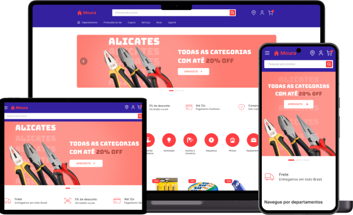

    

## 📝 Sobre o projeto
Casa Moura é um e-commerce de materiais de construção.

## 💻 Tecnologias usadas
- [NextJS](https://nextjs.org)
- [TypeScript](https://www.typescriptlang.org)
- [TailwindCSS](https://tailwindcss.com)
- [Firebase](https://firebase.google.com/products/firestore)
- [Mercado Pago](https://www.mercadopago.com.br)

## ✨ Principais funcionalidades
- [x] Pesquisa e filtragem de produtos
- [x] Página que exibe informações de um produto específico
- [x] Carrinho de compras (adicionar, alterar e remover produtos)
- [x] Cadastro e login de usuários
- [x] Checkout para realização e finalização de pedidos
- [x] Página de confirmação de compra
- [x] Atualização em tempo real do status do pagamento no banco de dados

## 🎨 Layout
Guia de estilo e prototipação das telas estão disponíveis no [Figma](https://www.figma.com/design/VfI83my6VZsLKM4GZJkBhO/Casa-Moura)

## ⚙️ Configuração do projeto
- [🔥 Configurar Firebase](settingsFirebase.md)
- [💵 Configurar gateway de pagamentos](settingsProject.md)
- [🚀 Configurar projeto](settingsProject.md)

## 💡 Autor
<table>
  <tr>
    <td align="center">
      <a href="https://github.com/hxmoura">
         
        
          <b>Henrique Moura</b>
        
      </a>
    </td>
  </tr>
</table>