# 🔥 Configuração do Firebase

### Requisitos
Ter uma conta criada no [Firebase](https://firebase.google.com)

### Passo a passo

##### Criação do projeto

1. Acesse o site do [Firebase](https://firebase.google.com/products/firestore) e clique em "Começar".
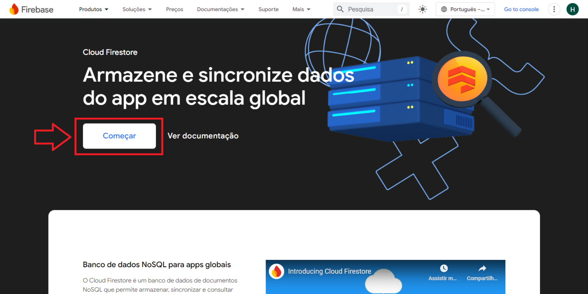

2. Adicione um novo projeto e escolha um nome para ele.
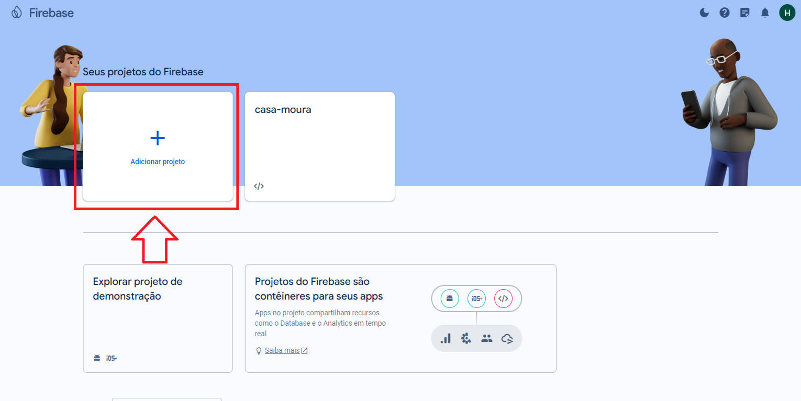

3. Desative o Google Analytics (não será necessário aqui), e crie o projeto.
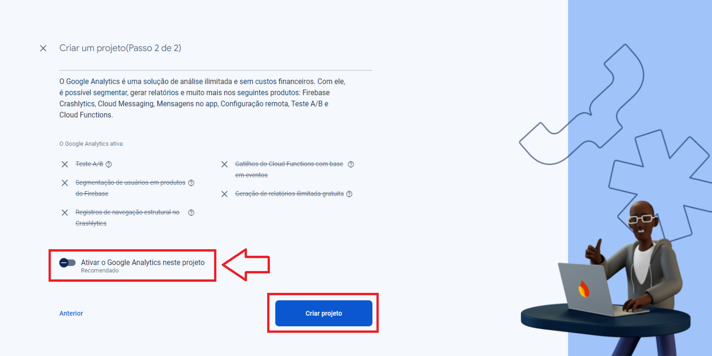

##### Criação do banco de dados

1. Com o projeto criado, no menu lateral selecione "Firestore Database" e crie um banco de dados.
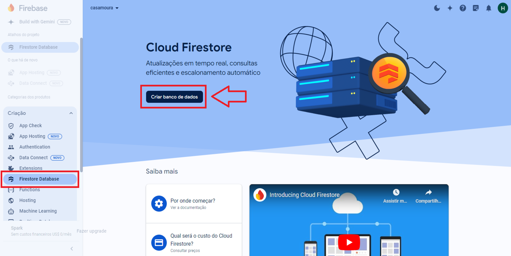

2. No poup-up, selecione apenas a localização do banco de dados, recomendamos o datacenter em São Paulo.

3. No passo seguinte, marque a opção "Iniciar no modo de produção", e confirme a criação do banco de dados.
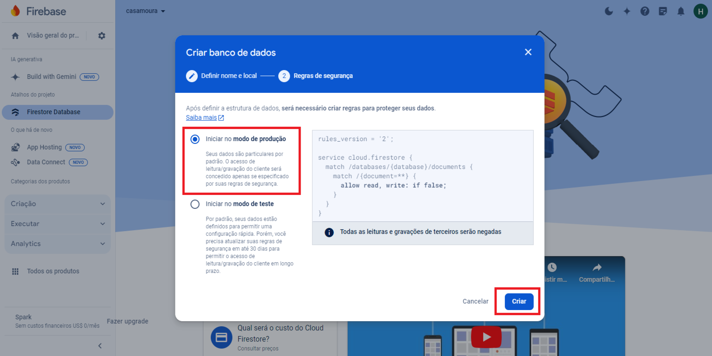

4. Conceda as permissões de gravação e leitura dos dados. No menu acima, clique em "Regras", troque `false` por `true` e publique as alterações.
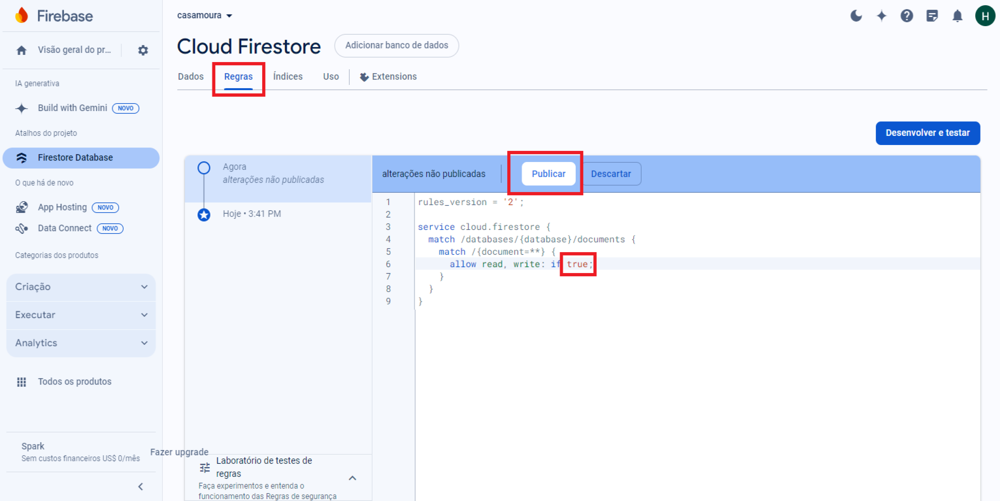
> Fazendo isso, você concede permissão de leitura e gravação de dados para qualquer pessoa que tiver acesso ao banco de dados, por isso tenha **cuidado**!

##### Autenticação

1. Agora precisamos configurar o Firebase Authentication, para lidar com o cadastro e login de usuários no projeto. No menu lateral, acesse a opção "Authentication", e clique no botão "Vamos começar".
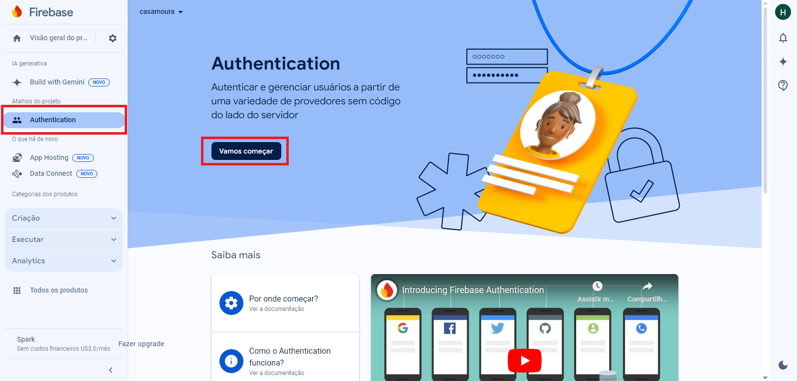

2. Em "Métodos de login", selecione o provedor "E-mail/Senha".
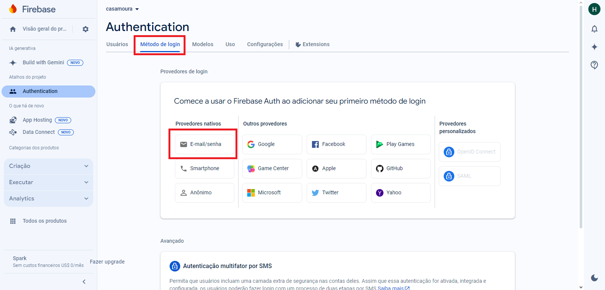

3. Ative a primeira opção "E-mail/Senha" e clique em salvar.
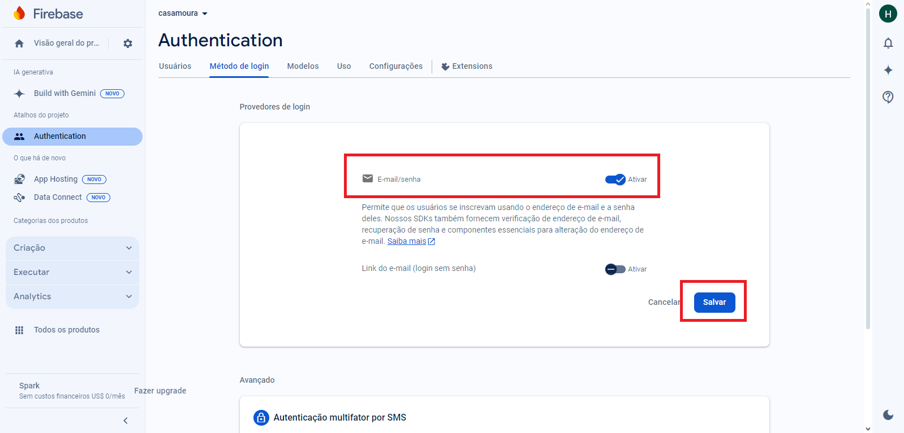

##### Pegue suas credenciais

1. No menu lateral em "Visão geral do projeto", clique no icone `</>` para configurar o Firebase para o projeto.
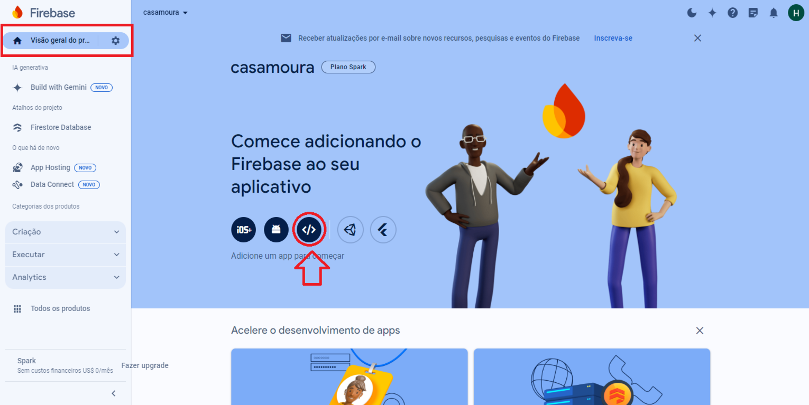

2. Informe um nome para sua aplicação web e clique em "Registrar app".
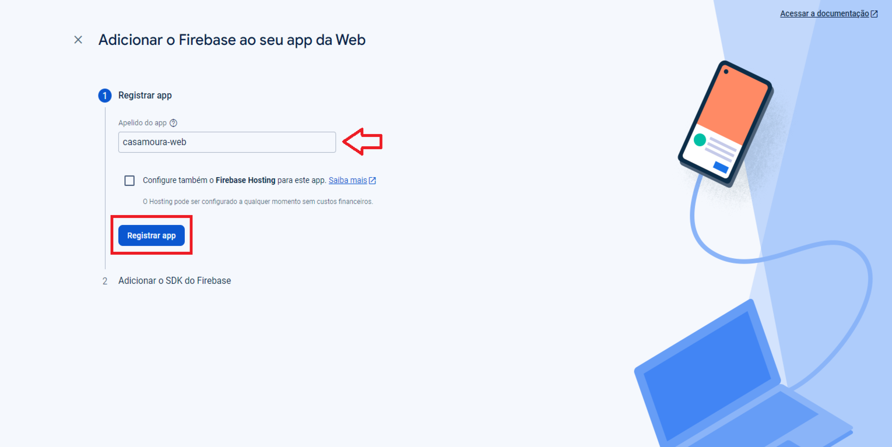

3. Você receberá as credenciais para conectar o projeto ao Firebase. Usaremos apenas **apiKey** e **projectId**, salve essas informações em um local seguro, pois usaremos futuramente.
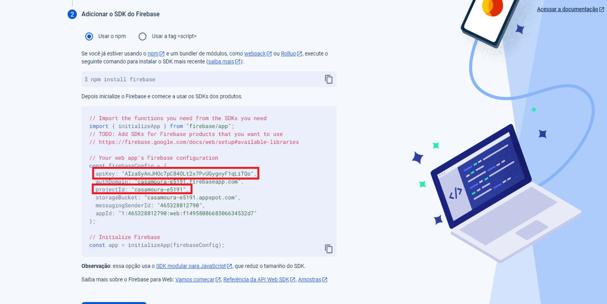

4. Feito todos os passos anteriores, siga para [configurar o gateway de pagamentos](settingsGateway.md).