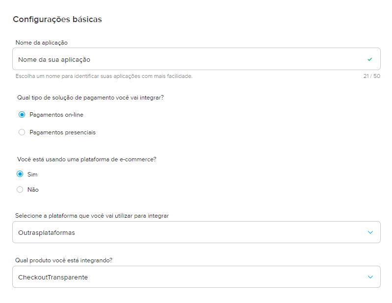
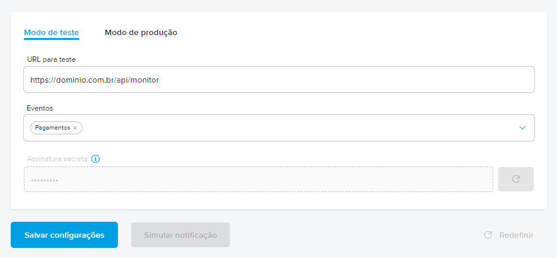

# 💵 Configuração do gateway de pagamentos

### Requisitos
Ter uma conta criada no [Mercado Pago](https://www.mercadopago.com.br)

### Passo a passo
1. Acesse o site [MercadoPago Developers](https://www.mercadopago.com.br/developers/pt)

2. No menu superior, acesse ``Suas integrações``

3. Clique em ``Criar aplicação`` e preencha o formulário conforme a imagem abaixo:

4. Após criar a aplicação, no menu lateral acesse ``credenciais de teste``

5. Copie e salve as credenciais **public key** e **access token**, pois usaremos mais tarde no projeto

6. Ainda no menu lateral, acesse a opção ``webhooks`` e clique em ``Criar notificações``

7. Preencha o formulário conforme a imagem abaixo e salve as configurações

> No campo de URL, informe a URL do seu projeto público seguido por **/api/monitor**, ou seja, se a URL do seu projeto for ``https://casamoura.com.br``, o resultado final ficaria algo como: ``https://casamoura.com.br/api/monitor``. Isso é importante para que o Webhook do Mercado Pago notifique os pagamentos aprovados e atualize automaticamente no banco de dados.

8. Feito todos os passos anteriores, siga para [configurar o projeto](settingsProject.md).